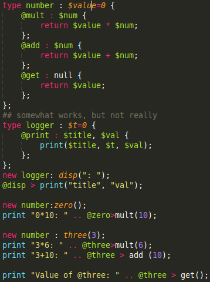

This was originally created as a small side project to pass some time, and although it's grown past that by now, it's nowhere near perfect. If you find any bugs that look fixable, please tell me; the hardest part about solving problems is not how to fix the issue, but how to find it.
# Syntax #
### Comments ###
Single-line comments are done with a pair of '#':

    ## some comment
Block comments are done like this:

    [#
	    some text
	#]

### Variable assignment: ###
    $var_name = value;
All variables are stored with global visibility except function and type arguments, so be careful when choosing names.
### Boolean Logic ###

    $var1 == $var2
    $var1 <= $var2
    $var1 ~= $var2

All boolean operators are the same as those in Lua.
### If/Select Statements ###
If statements in NGN are similar to those in other languages:

    if [condition] {
        ## code
    };
Conditions are parsed in Lua.

Although NGN has if/else and if/elseif statements, they are extremely unreliable - instead, use select or selectall. Although select statements are structured differently than if/elseif statements, they function exactly the same. A basic select statement looks like this:

    select {
        [condition 1] {
            ## code
        };
        [condition 2] {
            ## code
        };
        ## etc
    };
The first case to evaluate as non-false will be executed, and the program will exit the statement and continue executing. A selectall statement is identical to a select, but will execute EVERY case that is non-false:

    selectall {
        [condition 1] {
            ## code
        };
        ## etc
    };
In NGN, all values besides false and nil are considered non-false, including empty strings and 0.
### Loops ###
For loops:

    ## Default-step for loop:
    for $varname : $start, $end {
        print($varname);
        ## other stuff
    };
    ## Set-step for loop:
    for $varname : $start, $end, $step {
        ## do stuff
    };
    ## Dynamic-step for loop
    for $varname : $start, $end; [$varname+=$varname/2;] {
        ## do stuff
    };
While loops:

    while $conditions==true {
        ## do stuff
    };
The loop will repeat until $some_conditions is false. The conditions are re-evaluated after each loop.
### Function definition ###

    function funcName : $arg1, $arg2
    {
	    ## do stuff
	    return $arg1;
	};
### Types ###
Although they use the keyword "type", types could more accurately be called "templates." Once defined, a type can be used to create any number of instances. A type is declared like this:

    type type_name : $arg1=default_value, $arg2=default_value {
	    @method1 : $arg {
		    ## do something
		    return $arg*$arg1;
		};
		@method2 : null {
			## stuff
		};
	};
### Instances ###
Instances are created and used like this:

    new type_name: instance_name(args);
    instance_name > method (arg);
### Arrays ###
The syntax for array creation and access is exactly like it is in Lua:

    $array = {1, 2, 3, 4};
    $indexedArray = {["a"] = 1, ["b"] = 2, ["c"] = 3};
    $foo = $array[1]; ## result: 1
    $bar = $indexedArray["b"]; ## result: 2
The array.index syntax from Lua is not supported yet, but it will be soon.
### Output ###
To print things, you can use either this:

    print("stuff");
or this:

    print "stuff";
Those methods are equivalent, although the second is more prone to bugs.
### File I/O ###
File handles are uncomplicated to create - once initialized, they can be used to read from or write to a file any number of times. They can be closed, but there is no need to, as Lua does so automatically.

To create a file handle, use *open*:

    open <"file_name"> : handle;
The contents of the resulting handle can be read into a string:

    handle -> $str;

    ## The $ is optional, so
    ## handle -> str;
    ## would work just as well.
In that example, all the text contained in *handle*'s file is copied to *$str*.

Writing to a file is similar:

    handle <- "content to be written";
The content does not have to be a string - any data type or variable can be written except null values.
### Frames ###
You can modify the behavior of the language itself with frames - Lua code that defines new operators and syntax defititions. To load a frame, use

    loadframe "filename.fr";
On load, the code inside *filename.fr* will be run as raw Lua code - this feature can technically be used to run code as well as create frames, and doing so is not discouraged.
### Language Extensions ###
There are three components to a syntax definition: key, proc, and rank. The key is the pattern used to recognize the new syntax, proc is a function used to execute the chunk of code being handled, and rank is used when comparing your key to another syntax definition in case of ambiguity. For example, if you were writing a new type of for loop that could be interpreted as one of the standard loops, you would want to give it a rank of at least 2 or 3 to be sure that it would be interpreted the way you intend.

When defining a key, remember to put variable components in parentheses so they will be passed to your proc handler.
For example, if you were defining a syntax object that would take 3 arguments and print them, you would use something like this for your key:

    cl.key.print3 = "tripleprint (.-), (.-), and (.-);"
Of course, that key is just an example - if you were to actually do that, you would want to use %s- rather than single spaces for stylistic flexibility.

When a syntax object is parsed, its proc function is called with a local variable table, and everything in the key enclosed in parentheses. The proc function for the above key, for example, would look like this:

    cl.proc.print3 = function(lvars, a, b, c)
        print(a)
        print(b)
        print(c)
    end
